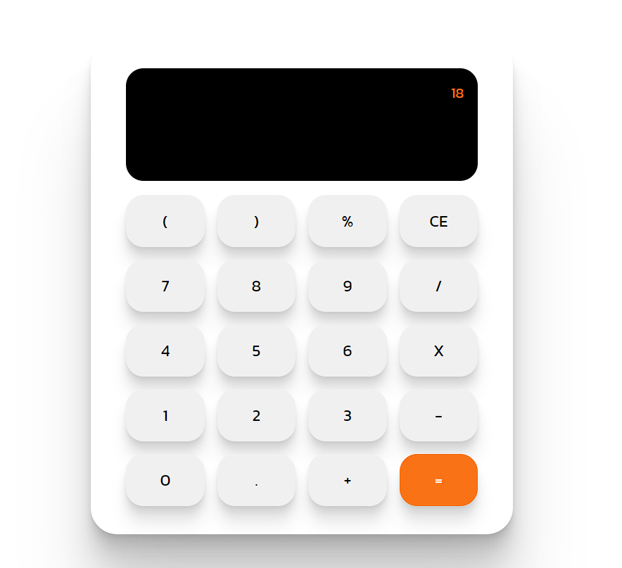

# calculator

This repository houses the code for a straightforward web-based calculator created using HTML, CSS, and JavaScript. It's a simple user-friendly and responsive calculator.

[checkout the calculator](https://susekh.github.io/calculator/)